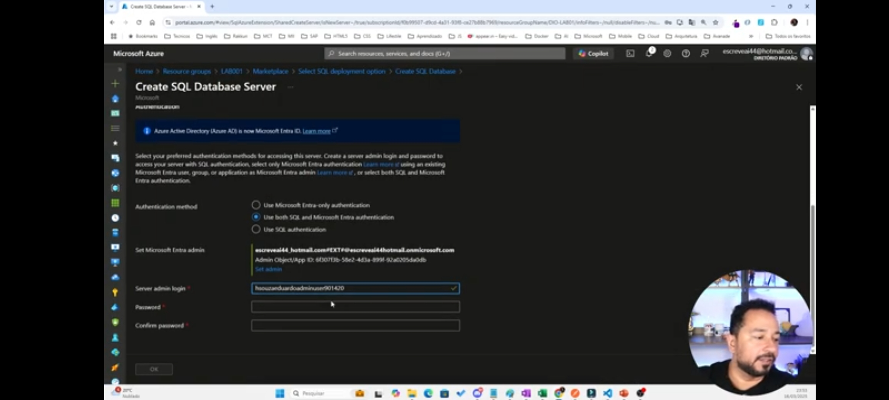

# azurecloudnative01
Projeto01
Aprendi no Azure Cloud Native da DIO
- Noções de cloud e cloud computing;
- serviços da nuvem;
- serviços e recursos do Azure;
- segurança e redundância dos datacenters  do Azure;
- criando recursos, VMs, redes, grupos de recursos e contas de armazenamento;

Resumo do projeto:

criando resourcegroup e sql database para inserir dados
